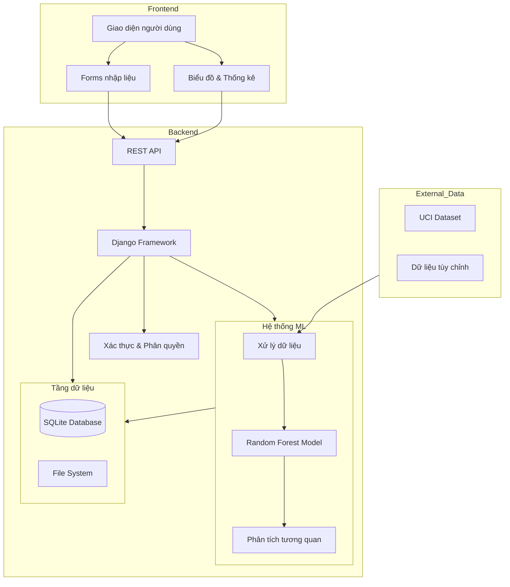
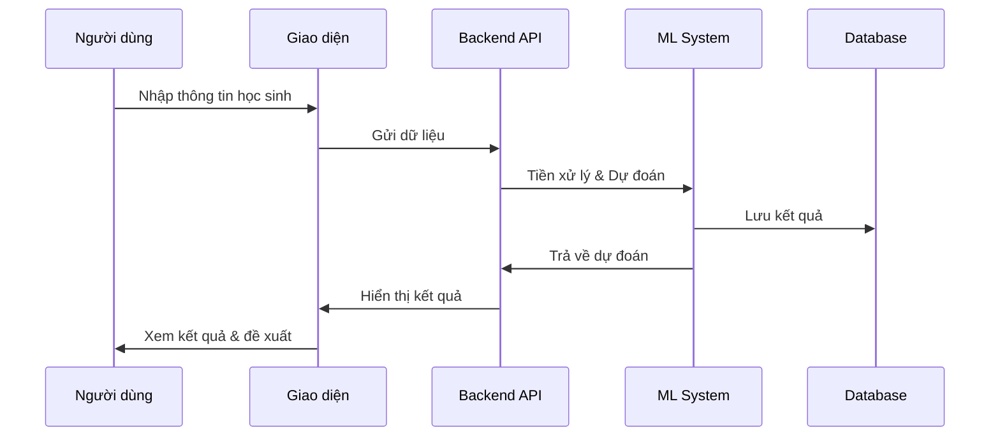
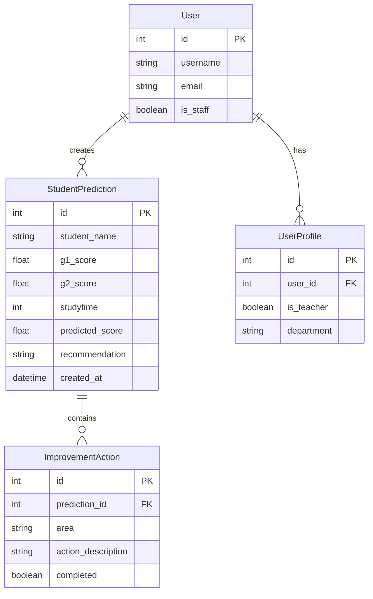

# HỆ THỐNG DỰ ĐOÁN ĐIỂM SỐ VÀ TƯ VẤN HỌC TẬP

## I. TỔNG QUAN HỆ THỐNG

Ứng dụng thông minh giúp dự đoán kết quả học tập và đề xuất phương pháp cải thiện điểm số, dựa trên:

- Phân tích dữ liệu học tập từ nhiều nguồn
- Áp dụng trí tuệ nhân tạo trong dự đoán
- Tư vấn phương pháp học tập cá nhân hóa

### Kiến trúc tổng thể



### Quy trình xử lý



### Mô hình dữ liệu



## II. TÍNH NĂNG NỔI BẬT

### 1. Dự đoán thông minh

- Dự báo điểm số dựa trên 30+ yếu tố ảnh hưởng
- Phân tích điểm mạnh, điểm yếu của học sinh
- Theo dõi và đánh giá tiến bộ liên tục

### 2. Hỗ trợ học tập

- Đề xuất kế hoạch học tập phù hợp
- Gợi ý phương pháp cải thiện điểm số
- Tạo lộ trình học tập cá nhân hóa

### 3. Quản lý và báo cáo

- Theo dõi tiến độ học tập chi tiết
- Đánh giá mức độ hoàn thành mục tiêu
- Tạo báo cáo phân tích định kỳ

## III. HƯỚNG DẪN SỬ DỤNG

### 1. Cài đặt hệ thống

#### Yêu cầu cơ bản

- Python 3.10 trở lên
- pip và Git
- Windows/Linux/MacOS

#### Cài đặt nhanh

Windows:

```powershell
git clone [repository-url]
cd student_score_predictor
.\setup.ps1
```

Linux/Mac:

```bash
git clone [repository-url]
cd student_score_predictor
chmod +x setup.sh
./setup.sh
```

#### Cài đặt thủ công

```bash
# Môi trường Python
python -m venv venv
venv\Scripts\activate     # Windows
source venv/bin/activate  # Linux/Mac

# Cài đặt thư viện
pip install -r requirements.txt

# Khởi tạo dữ liệu
python manage.py makemigrations
python manage.py migrate
python manage.py init_model

# Tạo tài khoản admin
python manage.py createsuperuser

# Khởi động ứng dụng
python manage.py runserver
```

## IV. CÔNG NGHỆ SỬ DỤNG

### 1. Backend

- Django 5.2.1: Framework web
- scikit-learn: Thư viện ML
- NumPy/Pandas: Xử lý dữ liệu

### 2. Frontend

- Bootstrap 5: Giao diện
- Chart.js: Biểu đồ
- SQLite: Cơ sở dữ liệu

## V. MÔ HÌNH DỰ ĐOÁN VÀ PHÂN TÍCH DỮ LIỆU

### 1. Quy trình xử lý dữ liệu

#### Thu thập dữ liệu
- **Dataset**: Student Performance Dataset (UCI ML Repository)
- **Kích thước**: 395 học sinh, hơn 30 thuộc tính
- **Loại dữ liệu**: Điểm số, thông tin cá nhân, yếu tố gia đình

#### Tiền xử lý dữ liệu
- **Làm sạch dữ liệu**: 
  - Xử lý giá trị thiếu bằng SimpleImputer
  - Loại bỏ nhiễu và giá trị ngoại lai
  - Chuẩn hóa dữ liệu số với MinMaxScaler

- **Mã hóa dữ liệu**:
  - Binary Encoding cho biến nhị phân (yes/no)
  - One-hot Encoding cho biến phân loại
  - Label Encoding cho biến thứ tự

### 2. Phân tích tương quan

#### Yếu tố ảnh hưởng chính
1. **Điểm kiểm tra (G1, G2)**: Tác động mạnh nhất (> 0.8)
2. **Thời gian học tập**: Tương quan tích cực (~0.3)
3. **Số lần trượt trước đây**: Tương quan tiêu cực (~ -0.4)
4. **Vắng mặt**: Ảnh hưởng tiêu cực (~ -0.25)
5. **Hỗ trợ gia đình**: Tác động tích cực (~0.15)

#### Phát hiện quan trọng
- Thời gian học hiệu quả: 3-4 giờ/ngày
- Hỗ trợ gia đình tăng điểm: 5-10%
- Cân bằng học tập - giải trí quan trọng

### 3. Mô hình dự đoán

#### Thuật toán chính
- **Random Forest Regressor**:
  - Số cây quyết định: 100
  - Độ sâu: Không giới hạn
  - Min samples split: 2
  - Min samples leaf: 1

#### Đánh giá mô hình
- **Cross-validation**: 5-fold
- **Metrics**: 
  - Mean Squared Error (MSE)
  - R² Score
  - Prediction vs Actual plots

#### So sánh mô hình
- **Random Forest**: R² > 0.85
- **Linear Regression**: R² ~ 0.75
- **Feature Importance Analysis**

## VI. THÔNG TIN TRIỂN KHAI

### 1. Tài khoản quản trị

- Username: admin
- Password: 6h1ehcjb!

### 2. Đóng góp phát triển

1. Fork dự án
2. Tạo nhánh mới
3. Thực hiện chỉnh sửa
4. Tạo Pull Request

### 3. Giấy phép

[MIT License](LICENSE)
