# DỰ ĐOÁN ĐIỂM SỐ HỌC SINH DỰA TRÊN CÁC YẾU TỐ ẢNH HƯỞNG

## CHƯƠNG 1: GIỚI THIỆU ĐỀ TÀI

### 1.1. Tổng quan
- Vấn đề dự đoán điểm số học sinh dựa trên các yếu tố ảnh hưởng
- Ý nghĩa và tầm quan trọng của việc dự đoán sớm kết quả học tập
- Khả năng ứng dụng trong thực tiễn giáo dục

### 1.2. Mục tiêu
- Xây dựng mô hình dự đoán điểm số học sinh
- Phân tích các yếu tố ảnh hưởng đến kết quả học tập
- Phát triển công cụ hỗ trợ giáo viên và phụ huynh

### 1.3. Phạm vi nghiên cứu
- Tập trung vào dữ liệu học sinh trung học
- Phân tích các yếu tố học tập và môi trường
- Dự đoán điểm cuối kỳ (G3) dựa trên các yếu tố đầu vào

## CHƯƠNG 2: THU THẬP VÀ XỬ LÝ DỮ LIỆU

### 2.1. Nguồn dữ liệu và Quy trình
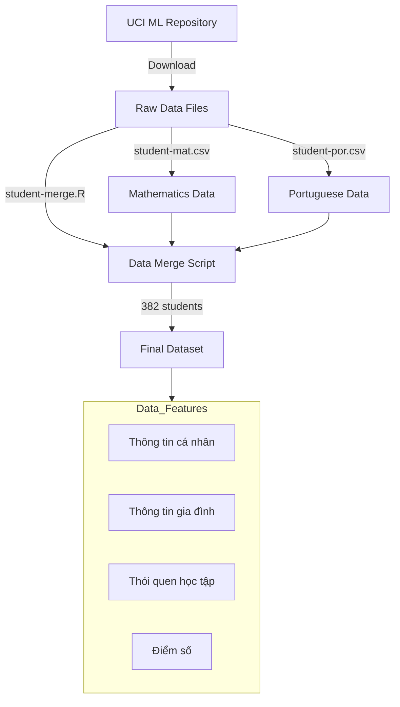

### 2.2. Đặc trưng dữ liệu
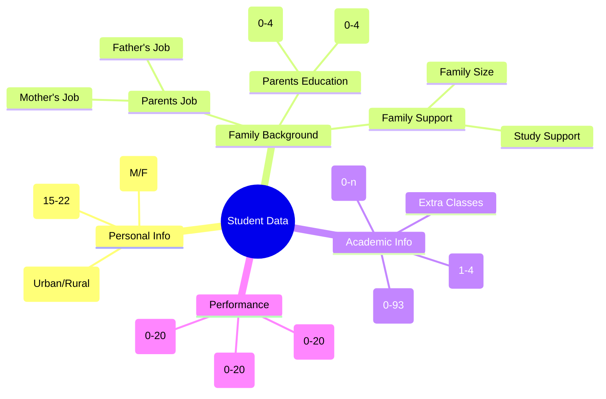

### 2.3. Tiền xử lý dữ liệu
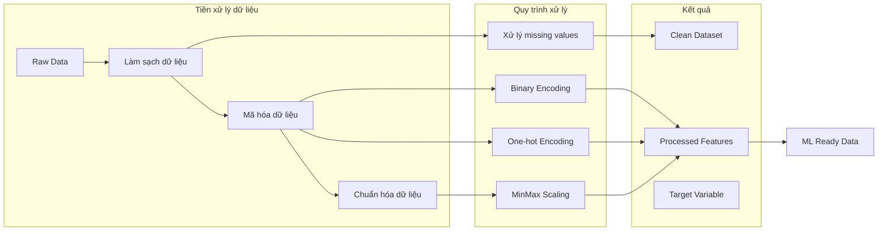

## CHƯƠNG 3: PHÂN TÍCH DỮ LIỆU & TƯƠNG QUAN

### 3.1. Phân tích tương quan

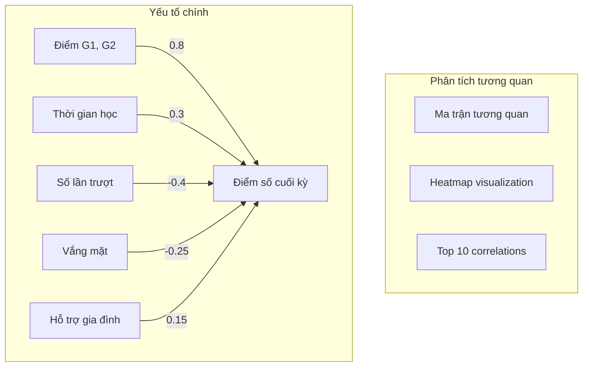

### 3.2. Phân tích chi tiết các yếu tố

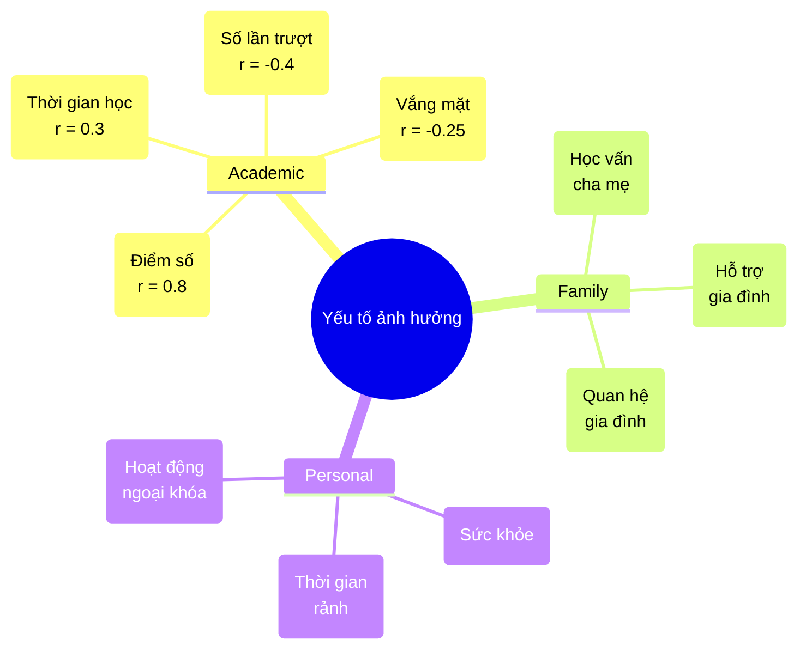

### 3.3. Trực quan hóa và phát hiện

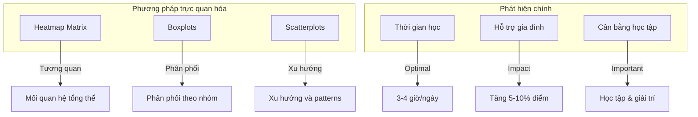

## CHƯƠNG 4: XÂY DỰNG MÔ HÌNH DỰ ĐOÁN

### 4.1. Kiến trúc mô hình

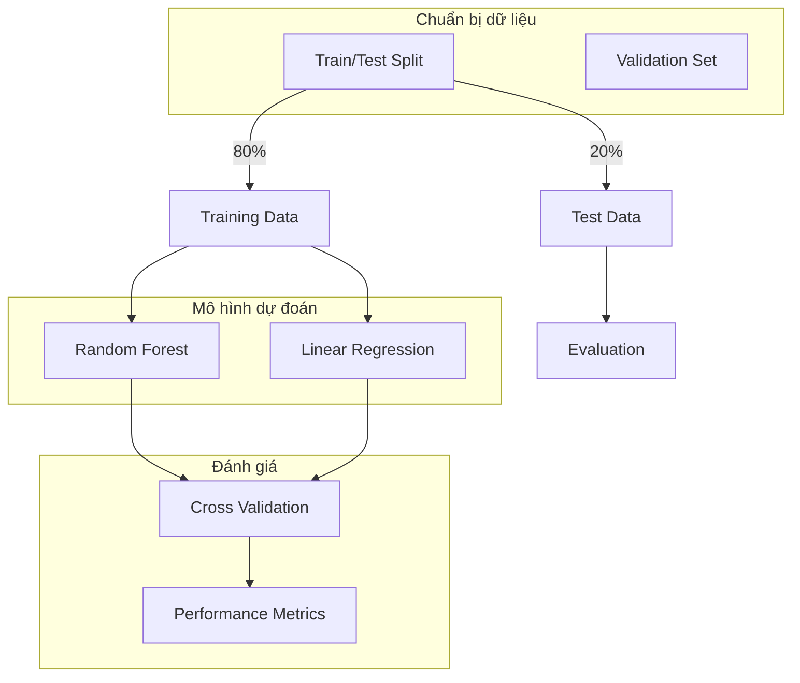

### 4.2. Quy trình huấn luyện và đánh giá

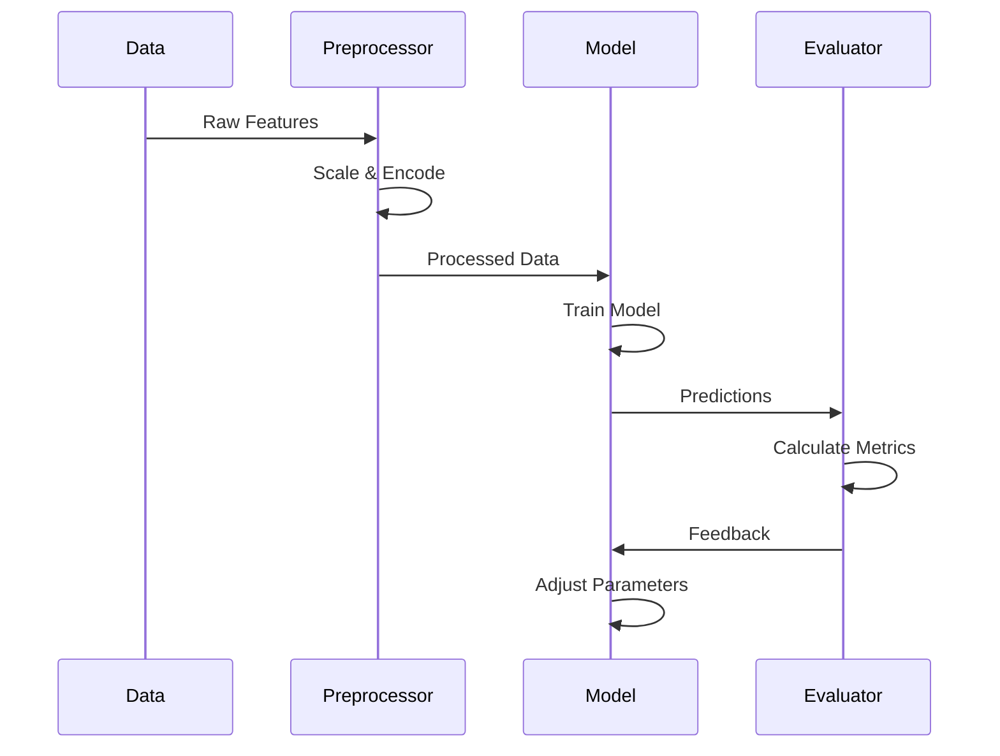

### 4.3. Tối ưu hóa và kết quả

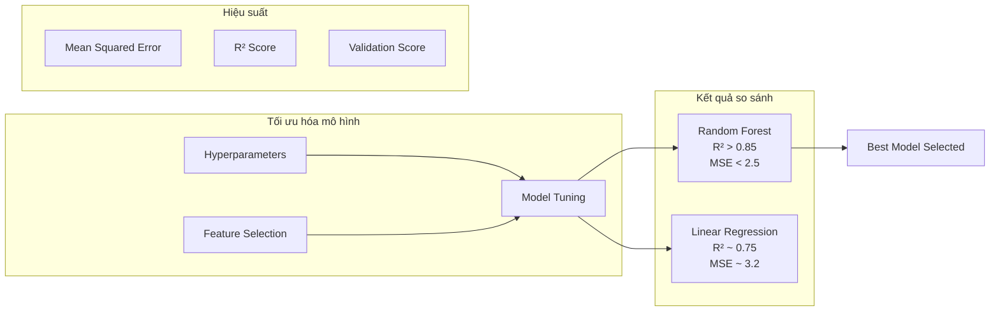

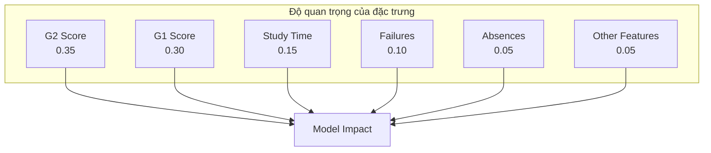

## CHƯƠNG 5: TRIỂN KHAI ỨNG DỤNG WEB

### 5.1. Kiến trúc hệ thống

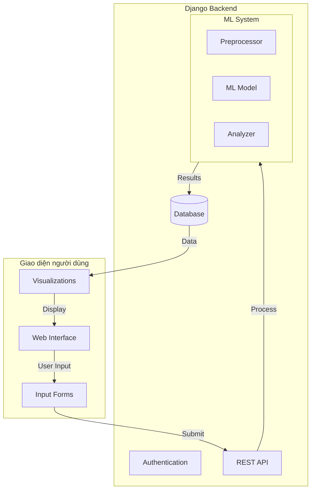

### 5.2. Luồng xử lý dự đoán

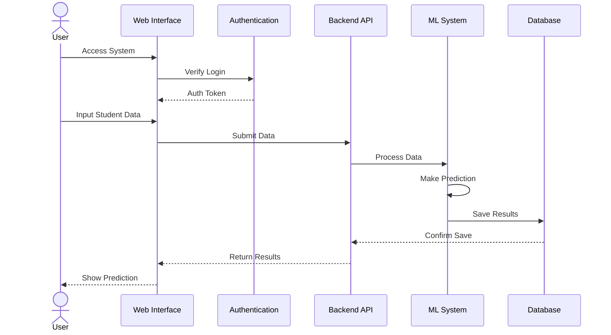

### 5.3. Mô hình dữ liệu và quyền hạn

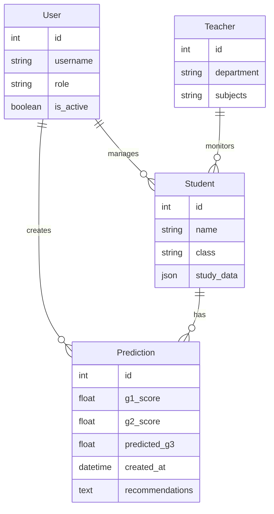

### 5.4. Tính năng và luồng người dùng

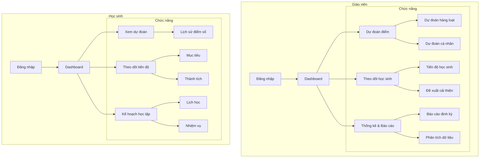

> **Giải thích biểu đồ tính năng:**
> - **Phân quyền người dùng**: Hệ thống phân chia 2 đối tượng chính là giáo viên và học sinh với các chức năng riêng biệt (theo mô hình `UserProfile` trong `predictor/models.py`)
> - **Giáo viên**: Có quyền truy cập toàn bộ tính năng dự đoán, theo dõi và phân tích
> - **Học sinh**: Tập trung vào theo dõi tiến độ cá nhân và nhận đề xuất cải thiện
> - **Dashboard**: Tùy theo vai trò mà hiển thị thông tin phù hợp (cài đặt trong `predictor/views.py`)

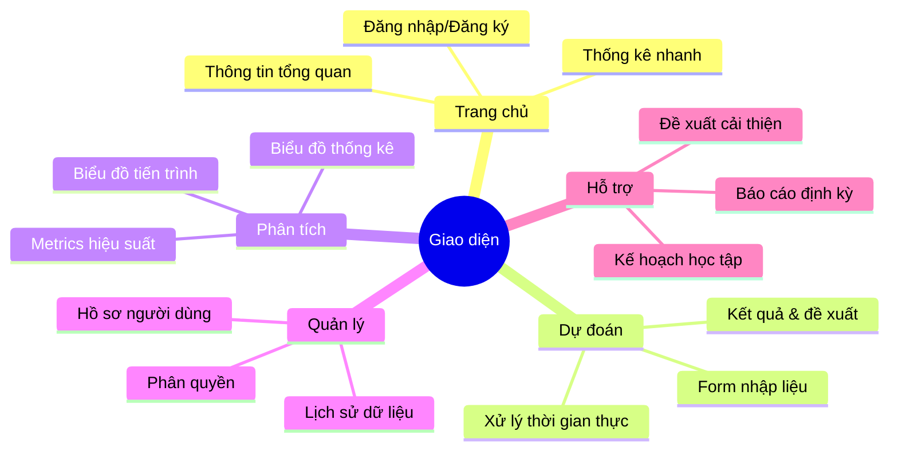

> **Giải thích giao diện:**
> - **Trang chủ**: Hiển thị dashboard tùy biến theo role người dùng (template: `predictor/templates/predictor/home.html`)
> - **Dự đoán**: Form thông minh với validation và xử lý real-time (form logic trong `predictor/forms.py`)
> - **Phân tích**: Sử dụng Chart.js để trực quan hóa dữ liệu (custom filters trong `predictor/templatetags/predictor_filters.py`)
> - **Quản lý**: Tích hợp hệ thống authentication của Django
> - **Hỗ trợ**: Tự động tạo kế hoạch và đề xuất dựa trên kết quả dự đoán

### 5.5. Triển khai và tương tác

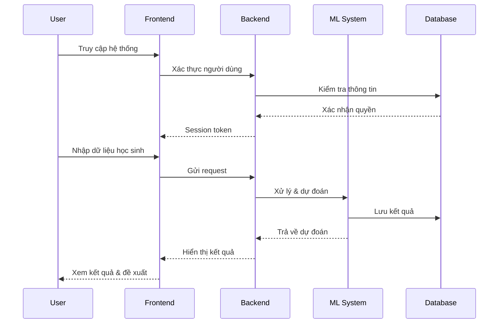

> **Giải thích quy trình:**
> - **Xác thực**: Sử dụng Django Authentication System với custom UserProfile
> - **Xử lý dữ liệu**: Validate và chuẩn hóa input thông qua Django Forms
> - **ML System**: Tích hợp mô hình RandomForest thông qua `ml_utils.py`
> - **Database**: Sử dụng SQLite để lưu trữ dữ liệu người dùng và kết quả dự đoán
> - **Frontend**: Responsive design với Bootstrap và custom CSS (`static/predictor/css/style.css`)

## CHƯƠNG 6: KẾT LUẬN & HƯỚNG PHÁT TRIỂN

### 6.1. Kết quả đạt được
- Mô hình dự đoán chính xác
- Phân tích được yếu tố ảnh hưởng
- Ứng dụng web hoàn chỉnh

### 6.2. Hạn chế
- Dữ liệu còn hạn chế
- Chưa tích hợp thêm nhiều yếu tố
- Cần thêm dữ liệu thực tế

### 6.3. Hướng phát triển
- Mở rộng dataset với dữ liệu local
- Thêm các thuật toán dự đoán mới
- Phát triển tính năng nâng cao

## TÀI LIỆU THAM KHẢO

1. P. Cortez and A. Silva. Using Data Mining to Predict Secondary School Student Performance. In A. Brito and J. Teixeira Eds., Proceedings of 5th FUture BUsiness TEChnology Conference (FUBUTEC 2008) pp. 5-12, Porto, Portugal, April, 2008, EUROSIS, ISBN 978-9077381-39-7.

2. UCI Machine Learning Repository: Student Performance Data Set
   https://archive.ics.uci.edu/ml/datasets/Student+Performance

3. Sklearn Documentation: Random Forest Regressor
   https://scikit-learn.org/stable/modules/generated/sklearn.ensemble.RandomForestRegressor.html

4. Django Documentation
   https://docs.djangoproject.com/